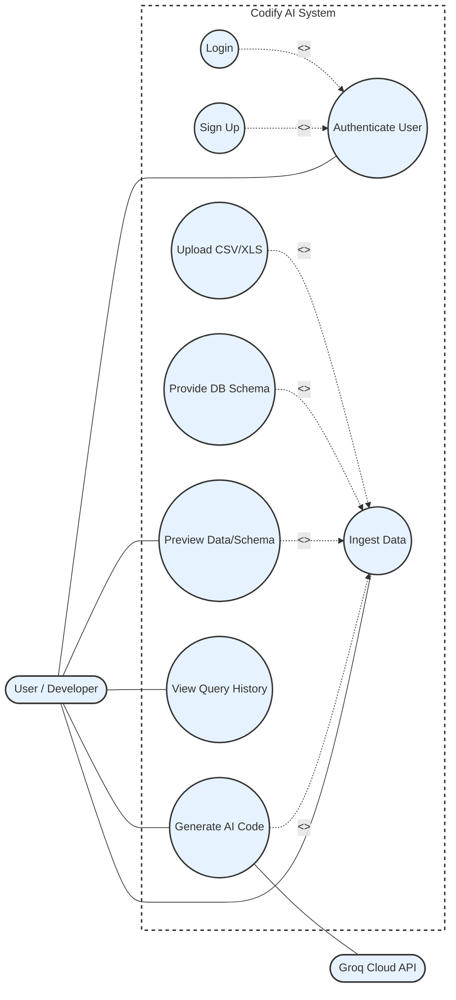

# Codify AI - Use Case Diagram

Here is the Mermaid source code for the Use Case Diagram. You can copy-paste this into any Mermaid-compatible editor (like Notion, GitHub, or Mermaid Live Editor).

```mermaid
flowchart LR
    %% Actors
    User([User / Developer])
    Groq([Groq Cloud API])
    
    %% System Boundary
    subgraph Codify ["Codify AI System"]
        direction TB
        %% Use Cases
        UC_Auth((Authenticate User))
        UC_Login((Login))
        UC_Signup((Sign Up))
        
        UC_Ingest((Ingest Data))
        UC_Upload((Upload CSV/XLS))
        UC_DB((Provide DB Schema))
        
        UC_Preview((Preview Data/Schema))
        UC_Gen((Generate AI Code))
        UC_Hist((View Query History))
        
        %% Includes and Extends Relationships
        UC_Login -.->|<<extends>>| UC_Auth
        UC_Signup -.->|<<extends>>| UC_Auth
        
        UC_Upload -.->|<<extends>>| UC_Ingest
        UC_DB -.->|<<extends>>| UC_Ingest
        
        UC_Preview -.->|<<extends>>| UC_Ingest
        UC_Gen -.->|<<includes>>| UC_Ingest
    end
    
    %% Relationships between Actors and Use Cases
    User --- UC_Auth
    User --- UC_Ingest
    User --- UC_Gen
    User --- UC_Preview
    User --- UC_Hist
    
    UC_Gen --- Groq

    %% Styling Elements
    classDef default fill:#E6F2FF,stroke:#333,stroke-width:2px;
    classDef sysBoundary fill:none,stroke:#333,stroke-width:2px,stroke-dasharray: 5 5;
    class Codify sysBoundary;
```
